# The Daily Reflection Tree — Visual Diagram

```mermaid
flowchart TD
    start["🌿 START<br/>The Daily Reflection Tree"]
    
    %% ════════════════════════════════════════
    %% AXIS 1 — Locus of Control
    %% ════════════════════════════════════════
    
    subgraph AXIS1["Axis 1: Locus of Control"]
        a1_q1["Q1: When something didn't go as planned?"]
        a1_q2["Q2: A deadline slipped — why?"]
        a1_q3["Q3: Interrupted during focused work?"]
        
        dec_a1_1{"Decision Node 1<br/>internal ≥ external?"}
        a1_q4_int["Q4-INT: What drives looking inward?"]
        a1_q4_ext["Q4-EXT: Had more influence than it felt?"]
        
        a1_q5["Q5: Hard work didn't land well?"]
        a1_q6["Q6: Where did you direct stress energy?"]
        
        chk_a1{"Checkpoint 1<br/>internal ≥ external?"}
        ref_a1_int["💭 Reflection: Agency pattern noticed"]
        ref_a1_ext["💭 Reflection: Outward attention pattern"]
        
        a1_q7["Q7: What went well — attribution?"]
        a1_q8["Q8: System slowed you down?"]
        a1_q9["Q9: Critical feedback — what did you do?"]
        
        dec_a1_2{"Decision Node 2<br/>internal ≥ external?"}
        a1_q10_int["Q10-INT: Over-responsibility tendency?"]
        a1_q10_ext["Q10-EXT: More power than you realized?"]
        
        a1_q11["Q11: Constraint you couldn't change?"]
        a1_q12["Q12: How day unfolded — most honest?"]
    end
    
    %% Axis 1 Flow
    start --> a1_q1 --> a1_q2 --> a1_q3 --> dec_a1_1
    dec_a1_1 -->|"internal ≥ external"| a1_q4_int --> a1_q5
    dec_a1_1 -->|"external > internal"| a1_q4_ext --> a1_q5
    a1_q5 --> a1_q6 --> chk_a1
    chk_a1 -->|"internal ≥ external"| ref_a1_int --> a1_q7
    chk_a1 -->|"external > internal"| ref_a1_ext --> a1_q7
    a1_q7 --> a1_q8 --> a1_q9 --> dec_a1_2
    dec_a1_2 -->|"internal ≥ external"| a1_q10_int --> a1_q11
    dec_a1_2 -->|"external > internal"| a1_q10_ext --> a1_q11
    a1_q11 --> a1_q12
    
    %% ════════════════════════════════════════
    %% BRIDGE 1
    %% ════════════════════════════════════════
    bridge1["🌊 Bridge 1: Shifting Focus<br/>Signal-aware variant text"]
    a1_q12 --> bridge1
    
    %% ════════════════════════════════════════
    %% AXIS 2 — Contribution vs Entitlement
    %% ════════════════════════════════════════
    
    subgraph AXIS2["Axis 2: Contribution vs Entitlement"]
        a2_q1["Q1: What you gave to your team?"]
        a2_q2["Q2: Colleague was overwhelmed?"]
        a2_q3["Q3: Credit given or not — how did you feel?"]
        
        dec_a2_1{"Decision Node 3<br/>contribution ≥ entitlement?"}
        a2_q4_con["Q4-CON: What sustains investing in others?"]
        a2_q4_ent["Q4-ENT: Moment helping crossed your mind?"]
        
        a2_q5["Q5: Not your job but needed doing?"]
        a2_q6["Q6: Shared team goal approach?"]
        
        chk_a2{"Checkpoint 2<br/>contribution ≥ entitlement?"}
        ref_a2_con["💭 Reflection: Generosity thread"]
        ref_a2_ent["💭 Reflection: Inward energy direction"]
        
        a2_q7["Q7: Energy toward others vs own success?"]
        a2_q8["Q8: Did anything no one will notice?"]
        
        dec_a2_2{"Decision Node 4<br/>contribution ≥ entitlement?"}
        a2_q9_con["Q9-CON: Cost of generosity?"]
        a2_q9_ent["Q9-ENT: Value beyond deliverables?"]
        
        a2_q10["Q10: Colleague gets promotion you wanted?"]
    end
    
    %% Axis 2 Flow
    bridge1 --> a2_q1 --> a2_q2 --> a2_q3 --> dec_a2_1
    dec_a2_1 -->|"contribution ≥ entitlement"| a2_q4_con --> a2_q5
    dec_a2_1 -->|"entitlement > contribution"| a2_q4_ent --> a2_q5
    a2_q5 --> a2_q6 --> chk_a2
    chk_a2 -->|"contribution ≥ entitlement"| ref_a2_con --> a2_q7
    chk_a2 -->|"entitlement > contribution"| ref_a2_ent --> a2_q7
    a2_q7 --> a2_q8 --> dec_a2_2
    dec_a2_2 -->|"contribution ≥ entitlement"| a2_q9_con --> a2_q10
    dec_a2_2 -->|"entitlement > contribution"| a2_q9_ent --> a2_q10
    
    %% ════════════════════════════════════════
    %% BRIDGE 2
    %% ════════════════════════════════════════
    bridge2["🌊 Bridge 2: Widening the Lens<br/>Signal-aware variant text"]
    a2_q10 --> bridge2
    
    %% ════════════════════════════════════════
    %% AXIS 3 — Radius of Concern
    %% ════════════════════════════════════════
    
    subgraph AXIS3["Axis 3: Radius of Concern"]
        a3_q1["Q1: Whose needs in your decisions?"]
        a3_q2["Q2: Disagreement — understand other side?"]
        
        dec_a3_1{"Decision Node 5<br/>others ≥ self?"}
        a3_q3_oth["Q3-OTH: What prompted wider view?"]
        a3_q3_self["Q3-SELF: Who else was affected?"]
        
        a3_q4["Q4: Systemic problem noticed?"]
        a3_q5["Q5: Frustration — how far did awareness extend?"]
        
        chk_a3{"Checkpoint 3<br/>others ≥ self?"}
        ref_a3_oth["💭 Reflection: Wide lens today"]
        ref_a3_self["💭 Reflection: Narrow focus today"]
        
        a3_q6["Q6: Customer/end-user impact awareness?"]
        a3_q7["Q7: Role in organization framing?"]
        
        dec_a3_2{"Decision Node 6<br/>others ≥ self?"}
        a3_q8_oth["Q8-OTH: What did wide view reveal?"]
        a3_q8_self["Q8-SELF: Whose wellbeing did you think about?"]
    end
    
    %% Axis 3 Flow
    bridge2 --> a3_q1 --> a3_q2 --> dec_a3_1
    dec_a3_1 -->|"others ≥ self"| a3_q3_oth --> a3_q4
    dec_a3_1 -->|"self > others"| a3_q3_self --> a3_q4
    a3_q4 --> a3_q5 --> chk_a3
    chk_a3 -->|"others ≥ self"| ref_a3_oth --> a3_q6
    chk_a3 -->|"self > others"| ref_a3_self --> a3_q6
    a3_q6 --> a3_q7 --> dec_a3_2
    dec_a3_2 -->|"others ≥ self"| a3_q8_oth --> bridge3
    dec_a3_2 -->|"self > others"| a3_q8_self --> bridge3
    
    %% ════════════════════════════════════════
    %% BRIDGE 3 → SUMMARY → END
    %% ════════════════════════════════════════
    bridge3["🌊 Bridge 3: Coming Together<br/>Signal-aware variant text"]
    summary["📊 SUMMARY<br/>Profile resolved from 2³ = 8 archetypes<br/>+ tension + reflection question"]
    endnode["🌿 END<br/>Thank you for pausing."]
    
    bridge3 --> summary --> endnode
    endnode -.->|"Start Again"| start
    
    %% ════════════════════════════════════════
    %% STYLING
    %% ════════════════════════════════════════
    classDef question fill:#1a1a2e,stroke:#d4935a,color:#e8e0d4
    classDef decision fill:#2d1b4e,stroke:#c47a3a,color:#e8e0d4
    classDef reflection fill:#1b2e1a,stroke:#7ab87a,color:#e8e0d4
    classDef bridge fill:#0f0f14,stroke:#d4935a,color:#d4935a
    classDef bookend fill:#2a1f0e,stroke:#d4935a,color:#e8e0d4
    
    class a1_q1,a1_q2,a1_q3,a1_q4_int,a1_q4_ext,a1_q5,a1_q6,a1_q7,a1_q8,a1_q9,a1_q10_int,a1_q10_ext,a1_q11,a1_q12 question
    class a2_q1,a2_q2,a2_q3,a2_q4_con,a2_q4_ent,a2_q5,a2_q6,a2_q7,a2_q8,a2_q9_con,a2_q9_ent,a2_q10 question
    class a3_q1,a3_q2,a3_q3_oth,a3_q3_self,a3_q4,a3_q5,a3_q6,a3_q7,a3_q8_oth,a3_q8_self question
    class dec_a1_1,dec_a1_2,chk_a1,dec_a2_1,dec_a2_2,chk_a2,dec_a3_1,dec_a3_2,chk_a3 decision
    class ref_a1_int,ref_a1_ext,ref_a2_con,ref_a2_ent,ref_a3_oth,ref_a3_self reflection
    class bridge1,bridge2,bridge3 bridge
    class start,summary,endnode bookend
```

## Legend

| Color | Node Type | Count | Description |
|-------|-----------|-------|-------------|
| 🟠 Orange border | Question | 36 | Behavioral multiple-choice (3–4 options each with a signal) |
| 🟣 Purple | Decision | 9 | Invisible routing — evaluates signal counts to branch |
| 🟢 Green | Reflection | 6 | Mid-flow insight referencing user's actual answer text |
| ⬛ Dark outline | Bridge | 3 | Transition between axes with signal-aware variant text |
| 🟤 Brown | Bookend | 3 | Start, Summary (8 archetypes), End |

**Total: 57 nodes · 6 true decision points · 8 summary profiles**
